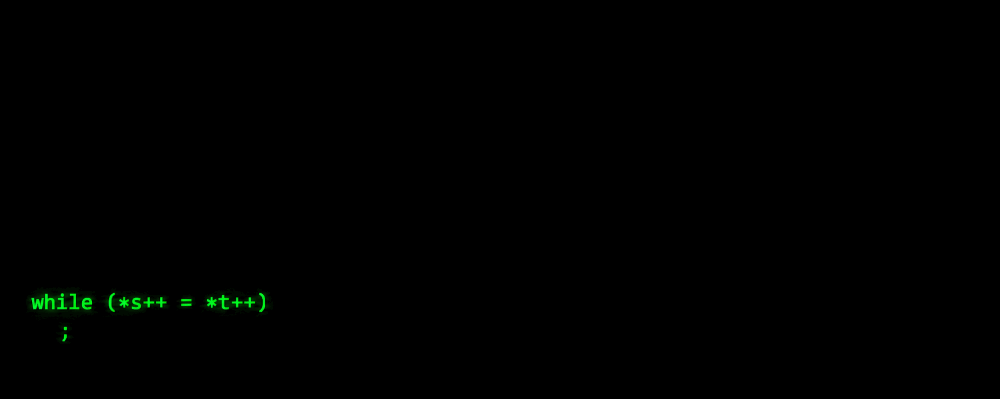

# Mikel Zabal Martín

Software doesn’t run on frameworks.  
It runs on processes. On memory. On signals.

---

C / C++ · Linux

fork() · execve() · pipes · signals 
threads · mutex · timing

---

Most people write code.

I follow what happens after it runs.
